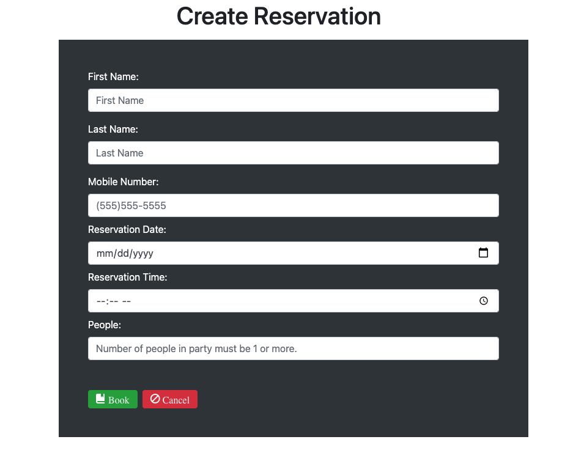
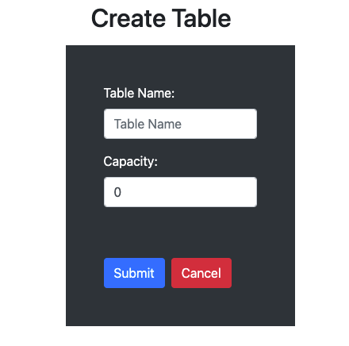

# Thinkful-Final-Capstone: Restaurant Reservation System

## Live Site
[Restaurant Reservation System]( "Restaurant Reservation System")  

## Application Summary
A Restaurant Reservation App that is used to create and record reservations and table assignments.  
The user can create new reservations and search for existing reservations by the guests phone number.  
The application also lets you seat reservations at a table and makes the table occupied when a reservation 
is sat it also allows the table to be switched back to unoccupied to let you seat another reservation at that table.

## Technology

### Built with:
* Postgres, as the backend data base

* Express, as the backend api
  * Organize backend process with routes
  * Organize/reuse controller functions for http requests
* Knex, to build Postgres queries in JavaScript
  * create migration files to populate the data base with relations
  * create seed files to populate the relations with dummy data for development
  * create service files to preform Postgres tasks for a given http request
* Cors, to allow the frontend origin access to the backend
* React, including Router and Hooks
  * Created with create-react-app
  * Organize/reuse code with React Components and Routes
  * Reduce api calls with useEffects and useStates triggering API calls only when relevant database changes are made
* Bootstrap 
* Heroku
  * Migrated the backend and frontend to Heroku cloud server

## Installation
1. Run `npm install` to install project dependencies.
2. To start the server and client run `npm start`
3. connect to a postgresql database by creating .env files for the backend and frontend
 ```js
// back-end .env example -> Connects to database
DATABASE_URL=enter-your-production-database-url-here
DATABASE_URL_DEVELOPMENT=enter-your-development-database-url-here
DATABASE_URL_TEST=enter-your-test-database-url-here
DATABASE_URL_PREVIEW=enter-your-preview-database-url-here
LOG_LEVEL=info


### Project Screenshots



